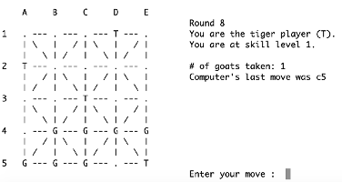

# gym_baghchal
Reinforcement learning applied to Bagh Chal board game via OpenAI's Gym toolkit.  



Many years ago on a visit to Nepal I learned how to play that country's Bagh Chal board game, which is similar to checkers or chess,
and on returning home I jotted up a simple character-based C code version of the game.
But it didn't go very far because there were just a few heuristics guiding the (essentially random)
computerized opponent.  Ever since then I've wanted to experiment with ways to train an algorithm to play this game better.

Now I've wrapped that BaghChal C code with Cython to make its various components
callable from Python, and developed it into an environment module for use with
Open Gym, the community standard open source reinforcement learning framework.
I followed Gym's guidelines for forming a package that imports Gym to work with
the BaghChal package code.

The present project is just to make that connection, and use Gym and PyBaghChal
to train an RL learner to take the human-as-tiger player role against the 
rudimentary computerized goat opponent.  After that the next step is to use that
trained learner as tiger, and against it train an RL learner to take the human-
as-goat role - so that would be iteration 2 where an new RL learner is trained
on the first RL learner.  Then the plan is to do several iterations, saving the
learners at each iteration for use as different skill levels of opponents.
Ha, we'll see how far I get!


## Installing
```bash
# first you may want to install more recent python on Ubuntu 16.04 than it has built in:
sudo apt update
sudo apt install software-properties-common
sudo add-apt-repository ppa:deadsnakes/ppa
sudo apt update
sudo apt install python3.7

# in any case, then create a python3 virtual env and install cython in it:
cd gym_baghchal
python3 -m venv .venv 
source .venv/bin/activate
pip install cython  # unfortunately must be done manually first before installing rl-bagh-chal
make                # build baghchal C and cython code, install it into the python environment,
                    #   run tests, autogenerate documentation
```

## Running
While the package is meant for running/training in Gym, the text/terminal based `baghchal` program can be run independently.  To do this, do:

```bash
make baghchal  # terminal-based app is not made by default   
baghchal_c_code/baghchal

# that output will look like terminal app at top of this readme
```

To run it in Gym, the most simple way to call it is as follows, similar to what's in this repo's `tests/test_gym.py` script.  However I'm still in progress on the `gym_baghchal/envs/baghchal_env.py` script which defines the calling of the BaghChal cython code from the Gym framework - it's not too complicated however, because the BaghChal cython/C entry point is called independently once per turn; mostly the script just connects the ins and outs and state propagation between turns...

```python
import gym

env = gym.make('gym_baghchal')
env.reset()
for _ in range(3):
    env.render()
    env.step(env.action_space.sample()) # take a random action
env.close()
```

## To do
- complete/debug `gym_baghchal/envs/baghchal_env.py`
- get autodoc working to autogenerate API of modules in with the docs in `docs/_build/html`...


## With thanks to...
for hints in getting started with the cython to:
<https://medium.com/@shamir.stav_83310/making-your-c-library-callable-from-python-by-wrapping-it-with-cython-b09db35012a3>

and for laying out the Gym interface to:
<https://github.com/openai/gym/blob/master/docs/creating-environments.md>
and
<https://github.com/nczempin/gym-tic-tac-toe>
